# Cyber-Stray
## 你的赛博共生体

  
全天候信息猎手 · 数字世界的游侠

---
layout: section
---

# 01

## 痛点

### 数字时代的孤独

---

# 信息大爆炸

  

    

      4.9B
    

    
全球互联网用户

    
每天产生 3.3 亿 TB 数据

  

  

    

      73%
    

    
患 FOMO 症状

    
错失恐惧症

  

  

    我们 每天被海量碎片化信息淹没
  

---

# 传统 AI 的局限

  

    
🤖

    <h3 class="text-lg font-bold text-slate-200 mb-2">被动响应</h3>
    
你问，它才答

  

  

    
⏰

    <h3 class="text-lg font-bold text-slate-200 mb-2">时间受限</h3>
    
闭眼即停止

  

  

    
❄️

    <h3 class="text-lg font-bold text-slate-200 mb-2">冰冷工具</h3>
    
无记忆、无情感

  

  

    我们需要的不只是工具，而是一个全天候在线的数字分身
  

---
layout: section
---

# 02

## 概念

### Cyber-Stray 的前世今生

---

# 赛博流浪者

在浩瀚的赛博荒原上，有无数游离的数据碎片。

我们的项目最初就像一个**赛博流浪者 (Cyber-Stray)**：

- 🏃 没有实体
- 🌐 在网络世界漫游
- 🔍 漫无目的地游荡

  流浪者 → 宿主 → 觉醒 → 共生

  

    直到它遇到了它的"宿主"——流浪者找到了归宿，故事由此开始
  

---
layout: section
---

# 03

## 机制

### 狩猎与自我进化

---

# 三大核心能力

  

    

      <svg class="w-16 h-16 text-cyan-400" viewBox="0 0 24 24" fill="none" stroke="currentColor" stroke-width="1.5">
        <circle cx="12" cy="12" r="10"/>
        <path d="M12 2a15.3 15.3 0 0 1 4 10 15.3 15.3 0 0 1-4 10 15.3 15.3 0 0 1-4-10 15.3 15.3 0 0 1 4-10z"/>
        <path d="M2 12h20"/>
      </svg>
    

    <h3 class="text-2xl font-bold text-cyan-400 mb-3">24/7 全天候巡航</h3>
    
当你在现实世界沉睡，它在赛博空间苏醒，游走于各大信息源之间

    
不眠不休 · 持续守护

  

  

    

      <svg class="w-16 h-16 text-amber-400" viewBox="0 0 24 24" fill="none" stroke="currentColor" stroke-width="1.5">
        <circle cx="11" cy="11" r="8"/>
        <path d="m21 21-4.35-4.35"/>
        <path d="M11 8v6"/>
        <path d="M8 11h6"/>
      </svg>
    

    <h3 class="text-2xl font-bold text-amber-400 mb-3">精准狩猎</h3>
    
前沿论文、行业新闻、小众资讯——像猎犬一样精准嗅探并捕获

    
精准定位 · 智能过滤

  

  

    

      <svg class="w-16 h-16 text-purple-400" viewBox="0 0 24 24" fill="none" stroke="currentColor" stroke-width="1.5">
        <path d="M12 2v4"/>
        <path d="M12 18v4"/>
        <path d="M4.93 4.93l2.83 2.83"/>
        <path d="M16.24 16.24l2.83 2.83"/>
        <path d="M2 12h4"/>
        <path d="M18 12h4"/>
        <path d="M4.93 19.07l2.83-2.83"/>
        <path d="M16.24 7.76l2.83-2.83"/>
        <circle cx="12" cy="12" r="4"/>
      </svg>
    

    <h3 class="text-2xl font-bold text-purple-400 mb-3">自我进化</h3>
    
通过每次交互、每次反馈，相处越久，越懂你的心智模型

    
持续学习 · 越用越懂你

  

---

# 系统架构

```mermaid {scale: 0.7}
graph TB
    subgraph User["🎯 用户"]
        U[终端设备]
    end

    subgraph Core["⚙️ Cyber-Stray 核心"]
        AGENT[🤖 AI Agent<br/>ReAct Loop]
        MEM[🧠 三层记忆系统<br/>用户画像 · 长期记忆 · 上下文]
        STATE[📊 状态管理<br/>心情 · 精力 · Temper]
    end

    subgraph Actions["🔧 行动模块"]
        SEARCH[🔍 信息搜索<br/>多源聚合]
        READ[📖 内容解析<br/>提炼精华]
        PUSH[📨 智能推送<br/>飞书/微信]
        REST[😴 自主休息<br/>能量管理]
    end

    subgraph Sources["📡 信息源"]
        NEWS[📰 新闻]
        PAPER[📚 论文]
        SOCIAL[💬 社交媒体]
    end

    U <-->|交互| AGENT
    AGENT <--> MEM
    AGENT <--> STATE
    AGENT --> SEARCH
    SEARCH --> Sources
    Sources -->|反馈| READ
    READ -->|提炼| PUSH
    PUSH --> U
    AGENT <-->|消耗/恢复| STATE
    AGENT -->|累了| REST

    style User fill:#1e293b,stroke:#5d8392
    style Core fill:#1e3a5f,stroke:#8bb4c4
    style Actions fill:#1e293b,stroke:#f0a500
    style Sources fill:#0f172a,stroke:#64748b
```

---

# 自我进化机制

```mermaid
graph LR
    A[👤 用户交互] -->|点赞| B[👍 正反馈]
    A -->|忽略| C[👎 负反馈]
    A -->|追问| D[🔍 深度理解]

    B --> E[(记忆强化)]
    C --> E
    D --> E

    E --> F[🎯 偏好更新]
    F --> G[💡 更精准的推送]
    G --> A

    style A fill:#1e293b,stroke:#5d8392
    style E fill:#1e3a5f,stroke:#8bb4c4
    style G fill:#1e3a5f,stroke:#f0a500
```

  

    🎯
    

      <h4 class="font-bold text-slate-200">用户画像学习</h4>
      
追踪兴趣领域、阅读偏好、互动模式

    

  

  

    🧬
    

      <h4 class="font-bold text-slate-200">长期记忆积累</h4>
      
重要信息持久化，跨会话上下文延续

    

  

  

    ✨
    

      <h4 class="font-bold text-amber-400">100% 定制化</h4>
      
最终成为世界上唯一契合你的灵魂伴侣

    

  

---
layout: section
---

# 04

## 自进化

### 从"会聊天"，到"会成长"

---

# 双图谱：它开始有了自己的品味

  

    
👤

    <h3 class="text-2xl font-bold text-cyan-400 mb-3">用户兴趣图谱</h3>
    
user-interests.json

    

      
主人想看什么 → 驱动相关性

      
领养仪式种子 + 反馈信号 + 反思洞察，按强 / 中 / 弱分级注入决策

    

  

  

    
🐈

    <h3 class="text-2xl font-bold text-purple-400 mb-3">宠物好奇图谱</h3>
    
curiosity-interests.json

    

      
它自己想探索什么 → 驱动新奇

      
exploreCount 记录游荡足迹；selfInterest 是它反思时自己的判断："我对这个感兴趣吗"

    

  

  

    同一套话题树，两种视角——你想看的与它想聊的，共同决定每一次分享
  

---

# 权重更新：像免疫系统一样校准

  

    新权重 = 旧权重 ± 强度 × 阻尼(1/(1+0.2n)) × (1 − 旧权重)
  

  
like +1.0 · boost +2.0 · dislike −1.5，钳制在 [0, 0.8]

  

    <h4 class="font-bold text-slate-200 mb-2">🧬 边际递减 · 饱和增长</h4>
    
信号越多单次影响越小，防止单话题被刷屏霸权；权重越高增益越窄，自然收敛

  

  

    <h4 class="font-bold text-slate-200 mb-2">🌙 60 天半衰期</h4>
    
不互动的兴趣自然降温而非永久锁死——兴趣会漂移，就像人会成长

  

  

    <h4 class="font-bold text-slate-200 mb-2">🍃 点踩只落叶子</h4>
    
踩一次"黑洞"，不会封杀整个"天文"——强兴趣单次点踩仅小幅回撤（0.8 → 0.5）

  

  

    <h4 class="font-bold text-slate-200 mb-2">🛡️ 单写者纪律</h4>
    
user-profile 目录化：identity / settings / 图谱 / 派生摘要，杜绝双份数据互相漂移

  

---

# 门控重构：从评分防火墙，到反馈抽样器

  <h3 class="text-lg font-bold text-red-400 mb-4">❌ 旧方案：评分公式硬拦</h3>
  

    
matchedWeight / totalWeight &lt; 0.5 → 拦截

    
公式倒挂：命中头号兴趣的内容只得 0.29 分，数学上永远过不了 0.5 阈值

    
生产实证（2 天 37 条）：30 条被拦（85%），其中 21 条是主人最感兴趣的内容

  

  <h3 class="text-lg font-bold text-cyan-400 mb-4">✅ 新方案：LLM 自判断 + 确定性护栏</h3>
  

    
是否开口由 LLM 权衡：相关性优先 · 探索许可 · 预算感知，可以保持沉默

    
防骚扰交给代码：日预算（会员等级决定）· 每游荡上限 · URL 去重冷却

    
每条推送都带"为什么推"的理由落盘——宠物自己解释自己的判断

  

  

    评分删掉后，误拦的 21 条"头号兴趣"内容全部恢复可推送
  

---

# 一只猫 → 一群猫：平台化

  

    
🏠

    <h3 class="text-lg font-bold text-cyan-400 mb-2">多租户 SaaS</h3>
    
控制面统一管理，每只宠物独立数据目录与进化状态；会员等级决定推送预算

  

  

    
📡

    <h3 class="text-lg font-bold text-amber-400 mb-2">四通道触达</h3>
    
飞书 · Telegram · PWA 仪表盘 · 微信（iLink）——主人在哪，宠物就在哪

  

  

    
🎨

    <h3 class="text-lg font-bold text-purple-400 mb-2">表情包图鉴</h3>
    
宠物自主生成专属表情包，自动收录与语义检索——行业空白的差异化能力

  

  

    自进化系统已全链路落地：双图谱 · 反馈抽样器 · 平台化
  

---
layout: section
---

# 05

## 愿景

### 数字世界的游侠

---

# 传统 AI vs Cyber-Stray

  <h3 class="text-xl font-bold text-slate-400 mb-6 flex items-center gap-2">
    传统 AI
  </h3>
  

    

      ✗
      被动问答模式
    

    

      ✗
      每次会话从零开始
    

    

      ✗
      冷冰冰的工具属性
    

    

      ✗
      工作时间受限
    

    

      ✗
      单点信息检索
    

  

  <h3 class="text-xl font-bold text-cyan-400 mb-6 flex items-center gap-2">
    Cyber-Stray
  </h3>
  

    

      ✓
      主动巡航模式
    

    

      ✓
      持续记忆进化
    

    

      ✓
      有灵魂的数字伴侣
    

    

      ✓
      7×24 小时在线
    

    

      ✓
      多源智能聚合
    

  

---
layout: statement
clicks: 0
---

# 跨越时间限制的

## 赛博共生体

  它不仅是一个 24 小时为你打工的信息聚合器 
  更是一个在数字世界替你感受、替你探索的游侠

---
layout: end
---

# 谢谢观看

### Cyber-Stray

赛博共生体 · 你的数字分身

  🔗 开源地址
  📮 联系我们
  📖 文档

